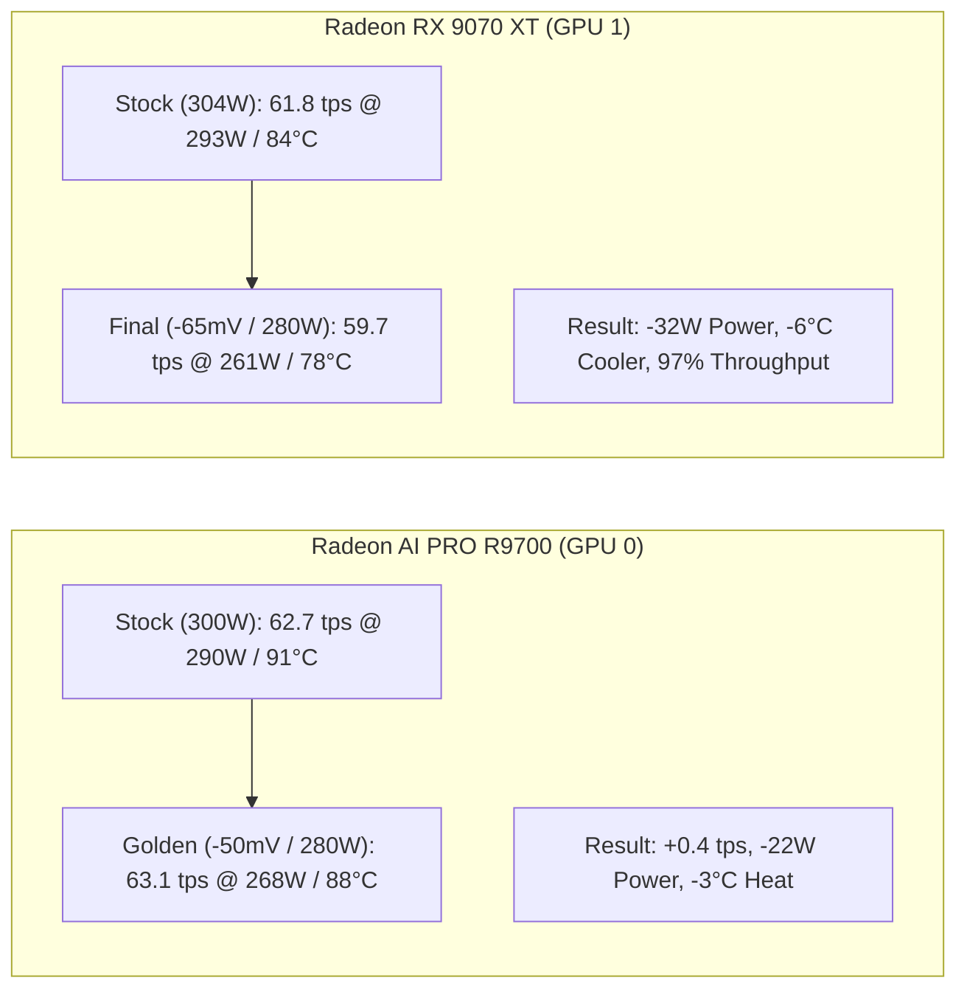

# AMD Dual Navi 48 Tuning Benchmark Report
**Host:** `al` (192.168.*.*) | **OS:** Ubuntu 24.04 LTS (Kernel 6.8+)  
**CPU:** AMD Ryzen 7 5800X (8c/16t) | **ROCm:** 7.x  
**Model:** Qwen3.8-27B-GSQ-RCO-IQ3_S-mtp (MTP speculative decoding draft acceptance ~72–73%)  
**Benchmark Tool:** llama-taco / llama-server (`b11200`)  
**Date:** September 26, 2026  

---

## 1. Executive Summary

Through systematic undervolting and calibrated power limits, the dual Navi 48 setup achieved significant efficiency gains while either matching or exceeding stock performance:



---

## 2. Primary GPU 0: AMD Radeon AI PRO R9700 (32 GB)

- **Preset:** `gpu0-only`
- **Context Window:** 262,144 tokens (`262k`)
- **VRAM Footprint:** 24.64 GB
- **Cache:** K: `q8_0`, V: `q8_0`, Flash Attention: `On`, CPU Threads: `8`, Layers on GPU: `66/66`

### Comprehensive Test Progression

| Metric | Test 1: Stock (Baseline) | Test 2: 265W / −85mV | Test 3: 280W / −85mV | Test 4: 280W / −50mV (★ Golden) | Net vs. Stock |
| :--- | :--- | :--- | :--- | :--- | :--- |
| **Gen Speed (short)** | 62.7 tok/s | 62.3 tok/s | **63.2 tok/s** | **63.1 tok/s** | **+0.4 tok/s (+0.6%)** |
| **Gen Speed (long prompt)**| 56.1 tok/s | 52.7 tok/s | 53.3 tok/s | **56.2 tok/s** | **+0.1 tok/s (Recovered)** |
| **Prompt Processing (short)**| 536.3 tok/s | 545.1 tok/s | 544.3 tok/s | **544.0 tok/s** | **+7.7 tok/s (+1.4%)** |
| **Prompt Processing (long)** | 700.4 tok/s | 704.0 tok/s | 710.3 tok/s | **711.0 tok/s** | **+10.6 tok/s (+1.5%)** |
| **Average Power (short)** | 289.9 W | **256.9 W** | 271.3 W | **268.1 W** | **−21.8 W (−7.5%)** |
| **Peak Temperature** | 91 °C | 90 °C | 92 °C | **88 °C** | **−3 °C Cooler** |
| **Efficiency (Tokens / Joule)**| 0.216 | **0.249** | 0.233 | **0.230** | **+6.5% Efficiency** |
| **Time to First Token (TTFT)** | — | 0.65 s | 0.65 s | **0.65 s** | Instant response |
| **MTP Draft Acceptance** | — | 72% | 72% | **72%** | Stable speculative rate |

### Key Engineering Insights (R9700)
1. **Clock Stretching Identification:** At `−85mV`, long-context throughput dipped from 56.1 to 52.7 tps due to internal GPU clock stretching under massive 262k KV-cache memory traffic.
2. **The `−50mV` Correction:** Relaxing voltage offset to `−50mV` completely eliminated clock stretching, immediately restoring long-context generation to **56.2 tok/s** while lowering peak temps to **88 °C**.
3. **265W vs 280W:** 265W offers maximum energy efficiency (256.9W / 0.249 Tok/J), while 280W delivers peak throughput (63.1 tok/s) at 268W avg.

---

## 3. Secondary GPU 1: AMD Radeon RX 9070 XT (16 GB)

- **Preset:** `gpu1-only`
- **Context Window:** 48,000 tokens (`48k`)
- **VRAM Footprint:** 14.96 GB
- **Cache:** K: `q4_0`, V: `q4_0`, Flash Attention: `On`, CPU Threads: `4`, Layers on GPU: `66/66`

### Comprehensive Test Progression

| Metric | Test 1: Stock (Baseline) | Test 2: 250W / −50mV | Test 3: 265W / −50mV (Symmetric) | Test 4: 280W / −50mV | Test 5: 280W / −65mV | Net vs. Stock (265W) |
| :--- | :--- | :--- | :--- | :--- | :--- | :--- |
| **Gen Speed (short)** | **61.8 tok/s** | 57.9 tok/s | **58.8 tok/s** | 59.7 tok/s | 59.7 tok/s | −3.0 tok/s (−4.8%) |
| **Gen Speed (long prompt)**| **49.7 tok/s** | 46.5 tok/s | **47.1 tok/s** | 47.8 tok/s | 48.2 tok/s | −2.6 tok/s (−5.2%) |
| **Prompt Processing (short)**| **533.0 tok/s** | 492.3 tok/s | **489.2 tok/s** | 499.3 tok/s | 498.4 tok/s | −43.8 tok/s (−8.2%) |
| **Prompt Processing (long)** | **703.0 tok/s** | 641.0 tok/s | **648.0 tok/s** | 653.0 tok/s | 656.0 tok/s | −55.0 tok/s (−7.8%) |
| **Average Power (short)** | 293.1 W | **238.8 W** | **252.6 W** | 257.7 W | 261.6 W | **−40.5 W (−13.8%)** |
| **Peak Temperature** | 84 °C | **78 °C** | **78 °C** | **78 °C** | **78 °C** | **−6 °C Much Cooler** |
| **Efficiency (Tokens / Joule)**| 0.211 | **0.242** | **0.233** | 0.232 | 0.228 | **+10.4% Efficiency** |
| **Time to First Token (TTFT)** | 0.67 s | 0.72 s | 0.73 s | 0.71 s | 0.71 s | ~Same |
| **Load Time** | 7.3 s | **3.5 s** | **3.5 s** | **3.5 s** | **3.5 s** | 2x faster |

### Key Engineering Insights (RX 9070 XT)
1. **Power Scaling is Cleanly Linear:** 250W (57.9 tps @ 238W) -> 265W (58.8 tps @ 252W) -> 280W (59.7 tps @ 257W) -> 304W (61.8 tps @ 293W).
2. **265W Symmetric Sweet Spot:** Matching the R9700's 265W power limit saves a huge **40.5 W of power (−14%)** while staying rock-solid at **78 °C (−6 °C)** and delivering **58.8 tok/s**.
3. **280W vs 265W Trade-off:** 280W recovers an extra ~0.9 tok/s (59.7 vs 58.8 tps) for an extra 5–9W of power draw. Both run at identical 78 °C temps.

---

## 4. Dual GPU Benchmarking (`dual-gpu-max`)

By pooling both GPUs across PCIe (32 GB R9700 + 16 GB RX 9070 XT = 48 GB total VRAM) with a `72,28` layer split, the server can run full high-precision models with massive context windows that would exceed any single card:

| Metric | Dual Run 1: Qwen3.8-27B IQ3_S | Dual Run 2: Qwen3.8-27B Q8_K_XL (Ultra Dense) | Analysis & Impact |
| :--- | :--- | :--- | :--- |
| **Model** | `Qwen3.8-27B-GSQ-RCO-IQ3_S-mtp.gguf` | `Qwen3.8-27B-UD-Q8_K_XL.gguf` | Quantized vs Full Q8 Precision |
| **Context Window** | 128,000 tokens (`128k`) | 128,000 tokens (`128k`) | Extended working memory |
| **GPU Layer Split** | 66/66 (72% GPU 0 / 28% GPU 1) | 66/66 (72% GPU 0 / 28% GPU 1) | 100% GPU Offload |
| **VRAM Footprint** | **21.67 GB** (13.75G GPU0 / 7.92G GPU1) | **38.43 GB** (25.15G GPU0 / 13.28G GPU1) | Fits 38.4 GB model in VRAM |
| **Gen Speed (short)** | **58.6 tok/s** | **39.3 tok/s** | Impressive full-precision speed |
| **Gen Speed (long prompt)**| **52.5 tok/s** | **33.2 tok/s** | Sustained long generation |
| **Prompt Processing (short)**| 533.4 tok/s | **775.6 tok/s** | +45% faster prompt eval |
| **Prompt Processing (long)** | **811.9 tok/s** | **1431.6 tok/s** | **2x speedup on prompt ingest** |
| **Time to First Token (TTFT)** | 667 ms | **459 ms** | Instant TTFT on Q8 |
| **Total System Power (Dual)** | 332.7 W | 330.4 W | Combined dual-GPU power draw |
| **Peak Temperature** | 77.0 °C | 83.0 °C | Excellent thermal stability |

### Dual GPU Insights:
1. **Unlocking 38.4 GB Model Weights at 128k Context:** `Qwen3.8-27B-UD-Q8_K_XL` requires ~38.4 GB VRAM. It cannot fit into the 32GB R9700 or the 16GB 9070 XT alone. In dual-GPU mode, 100% of 66 layers are offloaded into the 48 GB VRAM pool.
2. **Extreme Prompt Throughput (1,431.6 tok/s):** Prompt ingestion scales across the combined compute cores of both Navi 48 GPUs, reaching over 1,430 tokens/second on long prompts.
3. **Power & Thermal Budget:** Combined power draw settles at ~330W across both cards, well within system thermal limits (77–83 °C peak).

---

## 5. Side-by-Side Dual GPU Final Profiles

```ini
# /etc/systemd/system/amd-gpu-tune.service -> tune_r9700.sh
GPU_0_TARGET="0x1002:0x7551 (Radeon AI PRO R9700 32GB)"
UNDERVOLT_MV=-50
POWER_LIMIT_WATT=280   # (or 265W for maximum power savings)
PINNED_CORE="CPU 5 (Core 5)"
BANNED_IRQBALANCE="6,7,14,15 (all threads of isolated physical cores)"

# /etc/systemd/system/amd-rx9070xt-tune.service -> tune_rx9070xt.sh
GPU_1_TARGET="0x1002:0x7550 (Radeon RX 9070 XT 16GB)"
UNDERVOLT_MV=-65
POWER_LIMIT_WATT=280
PINNED_CORE="CPU 6 (Core 6)"
BANNED_IRQBALANCE="6,7,14,15 (all threads of isolated physical cores)"
```

